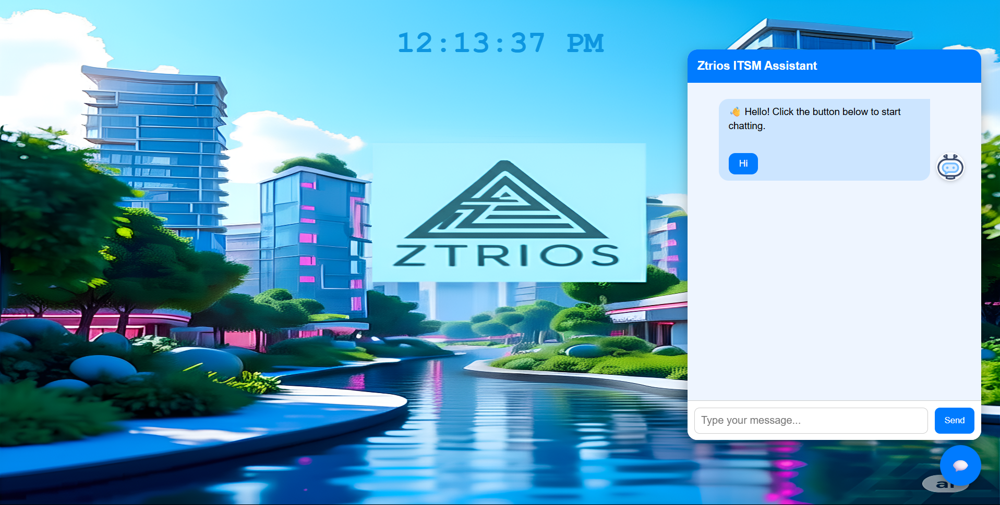

# Ztrios Technologies Ltd. ITSM Chatbot

## Project Overview

This project is an IT Service Management (ITSM) chatbot for Ztrios Technologies Ltd. It provides users with instant, context-aware support for common IT topics such as device setup, password resets, VPN configuration, backups, and troubleshooting. The chatbot uses a Retrieval-Augmented Generation (RAG) approach, combining a local knowledge base (vector database) with an LLM to answer user queries. It supports multiple users and multiple chat sessions, with all chat history stored per session.

**Key Features:**
- Multi-user, multi-session chat support
- Knowledge base search using FAISS vector database
- LLM-powered answers, with fallback to model knowledge if needed
- Web-based chat interface (Flask + JS)
- Asynchronous, thread-safe chat history storage
- Optional user profile support

---


## Project Structure

```
project-root/
│
├── app.py                  # Main Flask app (web server, API endpoints)
├── README.md               # Project documentation and setup instructions
├── requirements.txt        # Python dependencies
├── data/
│   └── synthetic_knowledge_items.csv   # Knowledge base CSV file
├── modules/
│   ├── index_builder.py    # Builds the FAISS vector index from the CSV
│   ├── retriever.py        # Retrieves relevant knowledge items from the vector DB
│   ├── chat_engine.py      # Core chat logic, prompt building, LLM integration
│   ├── chat_history.py     # Async, thread-safe chat history management
│   
├── static/
│   ├── chatbot.js          # Frontend chat logic (JS)
│   ├── style.css           # Frontend styles
│   └── z_w.png             # Logo or background image
├── templates/
│   └── index.html          # Main HTML template for the chat UI
├── vector_store/
│   ├── kb_index.faiss      # FAISS vector index file
│   └── kb_metadata.pkl     # Metadata for the knowledge base
└── chat_data.json          # Stores all chat histories (per session)
```

### File/Folder Descriptions

- **app.py**: Main Flask backend. Handles API endpoints, chat logic, session management, and connects frontend to backend.
- **requirements.txt**: Lists all Python dependencies needed to run the project.
- **README.md**: Project documentation, setup, and usage instructions.
- **chat_data.json**: Stores all chat histories, organized by user/session.
- **data/synthetic_knowledge_items.csv**: The knowledge base used for retrieval.
- **modules/**: Contains all backend logic modules:
    - `chat_engine.py`: Core RAG logic, prompt template, LLM integration.
    - `chat_history.py`: Async, thread-safe chat history management.
    - `index_builder.py`: Builds the FAISS vector database from the CSV.
    - `retriever.py`: Retrieves relevant knowledge from the FAISS index.
- **static/**: Frontend assets (JS, CSS, images):
    - `chatbot.js`: Handles chat UI, user/session IDs, and API calls.
    - `style.css`: Styles for the chat interface.
    - `z_w.png`: Logo or image asset.
- **templates/index.html**: Main chat UI template (Jinja2 for Flask).
- **vector_store/**: Stores the FAISS vector index and its metadata:
    - `kb_index.faiss`: The binary FAISS index.
    - `kb_metadata.pkl`: Pickled metadata for the index.

---


## Installation & Setup

### Prerequisites
- Python 3.9 or newer
- [Anaconda](https://www.anaconda.com/products/distribution) (recommended for environment management)
- `pip` (comes with Anaconda/Miniconda)
- [Git](https://git-scm.com/) for cloning the repo
- Obtain and set your API key (e.g., GROQ_API_KEY)

### 1. Clone the Repository
```bash
# Using Git (recommended)
git clone <your-repo-url> Ztrios-ITSM-Chatbot
cd Ztrios-ITSM-Chatbot
# Or download and extract the ZIP, then cd into the folder
```

### 2. Create and Activate a Conda Environment
```bash
# Create a new conda environment named 'ztriosbot' with Python 3.9
conda create -p venv python=3.10 -y
conda activate ./venv
```

### 3. Install Dependencies
```bash
pip install -r requirements.txt
```

### 4. Set Environment Variables
- For use Groq API, create a `.env` file in the project root:
  ```env
  GROQ_API_KEY=your_groq_api_key_here
  ```

### 5. Build the Vector Database (if not already built)
If you update `data/synthetic_knowledge_items.csv`, rebuild the vector DB:
```bash
python modules/index_builder.py
```

### 6. Run the Chatbot
- **Web App (Flask):**
  ```bash
  python app.py
  # Visit http://localhost:5000 in your browser
  ```

---

## Dataset Description

The knowledge base is stored as a CSV file (`data/synthetic_knowledge_items.csv`). Each row represents a knowledge item with the following columns:

- `ki_topic`: The main topic or title of the knowledge item.
- `ki_text`: The official, detailed instructions or information for the topic.
- `alt_ki_text`: An alternative, possibly more concise or differently worded version.
- `bad_ki_text`: An informal or less professional version (for testing).

**Example rows:**

| ki_topic                                 | ki_text (excerpt)                                                                                  | alt_ki_text (excerpt)                                                                 | bad_ki_text (excerpt)                                                                 |
|-------------------------------------------|----------------------------------------------------------------------------------------------------|---------------------------------------------------------------------------------------|---------------------------------------------------------------------------------------|
| Setting Up a Mobile Device for Company Email | **Setting Up a Mobile Device for Company Email**<br>**Prerequisites:** ...<br>**Step 1:** ...      | To set up a mobile device for company email, follow these steps: ...                  | Okay so like if you wanna get your company email on your mobile device you gotta ...   |
| Resetting a Forgotten PIN                 | **Resetting a Forgotten PIN**<br>If you have forgotten your PIN, you can reset it using ...        | If you have forgotten your PIN, you can reset it by following these steps: ...         | So, you forgot your PIN, huh? Don’t worry, it happens to the best of us ...           |
| Configuring VPN Access for Remote Workers | **Configuring VPN Access for Remote Workers**<br>**Overview** ...<br>**Step 1:** ...               | To configure VPN access for remote workers at Widgetco, follow these steps: ...        | So, you want to configure a VPN for those remote workers, huh? Well, it’s not too hard ... |

Each knowledge item is used to build the vector database for retrieval and to provide context to the LLM.

---


## Project Building Steps and How It Works

### Dataset Collection
Here used the [Synthetic IT-Related Knowledge Items](https://www.kaggle.com/datasets/dkhundley/synthetic-it-related-knowledge-items) dataset from Kaggle, and additional data was generated using ChatGPT to enrich the knowledge base. The combined data is stored in `data/synthetic_knowledge_items.csv` with columns: `ki_topic`, `ki_text`, `alt_ki_text`, and `bad_ki_text`.

### Building the Knowledge Base and Vector Database
To build the knowledge base and store it in a vector database:

1. The script `modules/index_builder.py` loads the CSV file and processes each row.
2. For each row, the script combines the topic, main text, alternative text, and bad text into a single string for embedding.
3. The script uses the `sentence-transformers` model (`all-MiniLM-L6-v2`) to generate embeddings for each combined text entry.
4. All embeddings are added to a FAISS vector index for efficient similarity search.
5. Metadata (topic and main text) for each entry is stored in a separate metadata file for retrieval.
6. The FAISS index is saved as `vector_store/kb_index.faiss` and the metadata as `vector_store/kb_metadata.pkl`.

Here used a dataset with 160 rows, so the chunk count is 160 (one chunk per row, as each row is treated as a single knowledge chunk).

All chunks and their metadata are saved in the `vector_store/` directory for use by the retriever and chat engine modules.

To rebuild the knowledge base after updating the CSV, run:
```bash
python modules/index_builder.py
```
This will regenerate the vector index and metadata files based on the latest CSV content.


### How the Retriever Works (`modules/retriever.py`)

The retriever loads the FAISS vector index and metadata created during knowledge base construction. When a user query is received:

1. The query is embedded using the same sentence-transformers model as the knowledge base.
2. The FAISS index is searched for the top-k most similar chunks (by vector distance).
3. For each candidate, cosine similarity is computed between the query and the chunk embedding.
4. Only chunks with similarity above a set threshold(50%) are returned as relevant results.
5. The retriever returns the metadata (topic and main text) for each matching chunk, which is then used to provide context to the LLM for answering the user.

This ensures that only the most relevant knowledge base entries are used to answer each user query.


### How the Chat Engine Works (`modules/chat_engine.py`)

The chat engine orchestrates the entire Retrieval-Augmented Generation (RAG) process for the ITSM chatbot. Here’s how it works step by step:

1. **Receives User Query:**
   - Accepts the user's message, session ID, and user ID.
2. **Retrieves Relevant Knowledge:**
   - Calls the retriever to find the top 3 most relevant knowledge base chunks (using similarity search and a threshold).
   - Extracts the main text from each relevant chunk to use as context.
3. **Loads Chat History:**
   - Loads the chat history for the current session and formats it for the prompt to hold context.
4. **Builds the Prompt:**
   - Constructs a prompt using a template that includes:
     - A company-branded introduction and instructions for the assistant
     - The retrieved knowledge base context
     - The conversation history
     - The current user question
     - Output formatting instructions (expects a JSON response)
5. **Invokes the LLM:**
   - Sends the prompt to the LLM to generate a response.
6. **Parses and Returns the Response:**
   - Parses the LLM’s output to extract the response string.
   - Handles any parsing errors gracefully.
7. **Stores Chat History:**
   - Appends the user’s message and the bot’s response to the session’s chat history for future context.
8. **Returns the Bot’s Reply:**
   - Sends the final response back to the user (via the web).

This process ensures that every answer is context-aware, leverages the knowledge base, and maintains a coherent conversation history for each session.


### How Chat History Management Works (`modules/chat_history.py`)

The chat history module manages all user and session conversations in an asynchronous and thread-safe way. Here’s how it works:

1. **Storage Location:**
   - All chat histories are saved in a single file: `chat_data.json` in the project root.

2. **Loading and Saving:**
   - Chat data is loaded and saved using async functions with a lock to prevent race conditions when multiple users or sessions are active.
   - The data is stored as a dictionary, with each session ID as a key.

3. **Session Structure:**
   - Each session contains the `user_id` and a list of `conversations`.
   - Each conversation entry includes:
     - The user's message
     - The bot's response
     - A timestamp (Bangladesh time, 12-hour format with AM/PM)

4. **Functions:**
   - `get_chat_history(session_id)`: Loads and returns the conversation list for a session.
   - `append_chat_history(session_id, user, bot, user_id)`: Adds a new message/response pair to the session, creating the session if it does not exist.

This design ensures that chat history is persistent, organized by session, and safe for concurrent access in both web and terminal chat modes.

---

## Multi-User and Multi-Session Chat Support

The prototype is designed to support multiple users, each of whom can have multiple independent chat sessions. Here’s how this is achieved:

1. **User ID Generation:**
   - Each user is assigned a unique user ID, which is typically generated as a random 8-character string (using Python's `uuid` module) if not provided by the frontend/client.
   - Example: `user_id = str(uuid.uuid4())[:8]`

2. **Session ID Generation:**
   - Every chat session is assigned a unique session ID, which is a combination of the user ID and a random string (again using `uuid`).
   - Example: `session_id = f"{user_id}_${uuid.uuid4().hex[:8]}"`
   - This allows each user to have multiple, independent chat sessions.

3. **Chat History Storage:**
   - All chat histories are stored in `chat_data.json`, organized by session ID.
   - Each session entry contains the user ID and a list of conversation turns (user message, bot response, timestamp).
   - This allows the system to maintain separate histories for each session, even for the same user.

4. **Handling Multiple Users and Sessions (Concurrency):**
   - The chat history module uses `from asyncio import Lock` to create an async lock (`history_lock`).
   - All read and write operations to `chat_data.json` are wrapped in `async with history_lock:` blocks.
   - This ensures that when multiple users or sessions are active at the same time, their chat histories are updated safely and without data corruption.

5. **Frontend and Backend Coordination:**
   - The frontend (web or terminal) manages user and session IDs, sending them with each message to the backend.
   - The backend uses these IDs to retrieve and update the correct chat history, ensuring that conversations do not mix between users or sessions.

This architecture enables robust, scalable support for multi-user, multi-session chat, making the chatbot suitable for real-world ITSM scenarios where many users may need help at the same time.

---

## Example User Inputs

Here are some sample queries you can try with the chatbot:

- How to reset a computer IP address
- Tell me how to reset a computer DNS cache
- Tell me how to reset the forgotten VPN password
- How to install company email on Outlook app
- Tell me how to remove malware from my smartphone
- Tell me how to reset my smart watch

These are example questions that, if present in the knowledge base, will be matched and retrieved from the vector database to provide helpful, step-by-step answers. The knowledge base is designed to hold this type of IT support context to assist users.

**Note:** This is a demo project, so the knowledge base may not have enough data to answer every possible IT support question.

---

## Author

**Asif Pervez Polok**  
AI Engineer  
Email: asifperveznstu.jsr369@gmail.com

---


